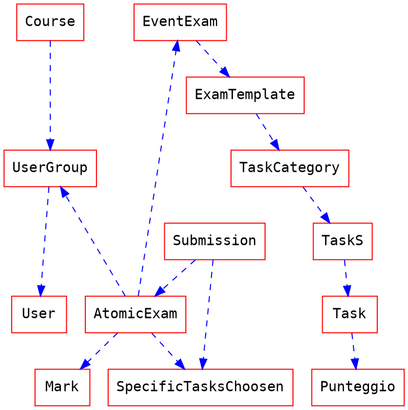

# Entità

## ~~Teacher assistant~~

## User group
_gruppo di **uno** o più utenti_

## User
### Attributes
- StudentNumber
- Name
- Surname

## Course
### Attributes
- GroupIds[ ]

## Exam template
### Attributes
- taskCategories[ ]
- numeroDiTaskPerOgniTaskCategory[ ] _per quando li si fa randomizzati_

## Task
_Domanda specifica o esercizio_
## Task Category
_Argomento di una domanda (es. domanda di teoria su git)_
### Attributes
- taskIds[ ]

## Exam
_Un esame usa un task group, e ogni task group può essere riutilizzato in più esami_

- TeacherAssistant
- ExamTemplateId
- PenalityRule

## AtomicExam
### Attributes
- ExamId
- taskIds[ ]
- StudentId/GroupId

## Submission
- AssignmentId
- TaskId
- Mark
    - DefinitiveMark
    - ProposedMarkByOtherGroups[]
        - ReviewerGroupIds[]
- Penality
- Comment
- Deadline (giorno di apertura e chiusura)
    - relativa/assoluta _da fare entro x / da fare in y ore_

_possibilità di fare la media se non si specifica uno o più parametri_

# Grafi
